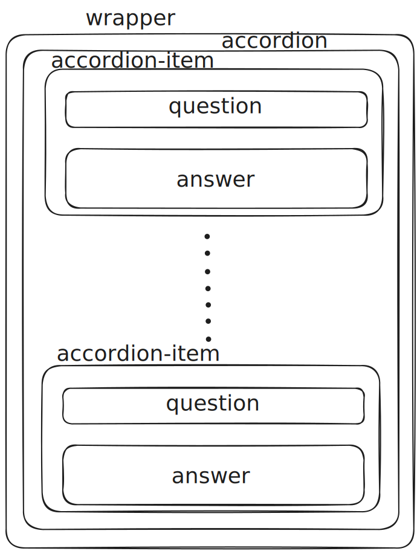
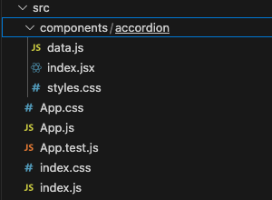

# Greetings

Greetings from a passionate beginner front-end engineer.
I hope this post finds you healthy and well, and you are progressing toward achieving your goals.

# Overview
To enhance my front-end development skills and, more importantly, my React skills, I started the Build 25 React Projects tutorial offered on freeCodeCamp.org by Sangam Mukherjee.
In the beginning, I started assuming the copycat role, that is I followed along with the tutor. 

Despite the fact the code that the tutor solved the two challenges presented, that is single-selection and multi-selection behavior, I realized an opportunity to improve the user experience (UX). The problem emerges when switching between states. In particular:
- When an accordion item is clicked and the state of the component changes to multi-select then the already expanded accordion item cannot be collapsed.
- The same holds true when accordion items are expanded in a multi-selection state and the state changes to single-selection. The already expanded items cannot be collapsed.

Finally, the plus sign (`+`) is changed to the minus sign (`-`) when the accordion item is expanded. Whereas, in the initial project remains the same, a plus sign (`+`).

Therefore, I started solving the challenge from scratch by my own.

# Design First, Code Later
Having experienced the *staring at an empty canvas* feeling, before I start tackling a challenge/issue I try to solve the problem first. In this case, it involves to design how the `div` elements will be organized:
<figure>
    
    <figcaption><i>Picture 1: div Elements Organization</i></figcaption>
</figure>

# Accordion Component Implementation
To the filesystem organized and neat, a folder under the name of *components* was created which contains the *accordion* folder, where the necessary code for the implementation of the *Accordion* is resided.

These files are:
- `index.jsx` -> where the *Accordion* implementation logic is located.
- `styles.css` -> where the necessary CSS rules for the *Accordion* component are located.
- `data.js` -> where the needed data for the content and *accordion-item* identification are located in a JSON format.

<figure>
    
    <figcaption><i>Picture 2: Filesystem structure</i></figcaption>
</figure>

## Single Selection Accordion Items
According to *Picture 1* the `div` elements with the class `wrapper` and `accordion` are fixed `div` elements:

```HTML
<div className='wrapper'>
    <div className='accordion'>

    </div>
</div>
```

Thus, for every single JSON object in the `data.js` file, an `accordion-item` should be rendered (`div`) which, consequently, contains two other divs, `question` and `answer`.
Therefore, JSX should be used to iterate the array that holds the JSON objects and render the aforementioned three divs, `accordion-item`, `question` and `answer`:

```HTML
<div className='wrapper'>
    <div className='accordion'>
        {
            data.map( (dataItem) => (
                <div key={dataItem.id} className='accordion-item'>
                    <div className='question'>
                        <h3>{dataItem.question}</h3>
                        <span>+</span>
                    </div>
                </div>
            ))
        }
    </div>
</div>
```

To render the `answer` div as well, we need to add a local state to our component using the `useState()` React hook. Having a state to track whether the `question` has been clicked allows to render dynamically the `answer` div:

```JSX
import data from './data';

import { useState } from 'react';

function Accordion(){
    const [selectedItem, setSelectedItem] = useState(undefined);

    return(
        <div className='wrapper'>
            <div className='accordion'>
                {
                    data.map( (dataItem) => (
                        <div key={dataItem.id} className='accordion-item'>
                            <div className='question'>
                                <h3>{dataItem.question}</h3>
                                {
                                    selectedItem === dataItem.id
                                    ? <span>-</span>
                                    : <span>+</span>
                                }
                            </div>
                            {
                                selectedItem === dataItem.id
                                ? (
                                    <div className='answer'>
                                        <p>{dataItem.answer}</p>
                                    </div>
                                )
                                : null
                            }
                        </div>
                    ))
                }
            </div>
        </div>
    );
}

export default Accordion;
```
> Having the local state being added, we can also render `-` or `+` depending on whether the accordion item is clicked or not.

Moving forward, we need to add a click event which will set the local state to the `id` of the accordion item:

```JSX
import data from './data';

import { useState } from 'react';

function Accordion(){
    const [selectedItem, setSelectedItem] = useState(undefined);

    const handleSingleSelection = (questionId) => {
            setSelectedItem(
                selectedItem === questionId 
                ? undefined 
                : questionId
            );
    }

    return(
        <div className='wrapper'>
            <div className='accordion'>
                {
                    data.map( (dataItem) => (
                        <div key={dataItem.id} className='accordion-item'>
                            <div className='question'
                                 onClick={ () => handleSingleSelection(dataItem.id) }
                            >
                                <h3>{dataItem.question}</h3>
                                {
                                    selectedItem === dataItem.id
                                    ? <span>-</span>
                                    : <span>+</span>
                                }
                            </div>
                            {
                                selectedItem === dataItem.id
                                ? (
                                    <div className='answer'>
                                        <p>{dataItem.answer}</p>
                                    </div>
                                )
                                : null
                            }
                        </div>
                    ))
                }
            </div>
        </div>
    );
}

export default Accordion;
```
> At this stage the single selection accordion has been completed.

## Multi-Selection Accordion Items
Having the single selection being implemented, the multi-selection implementation will be presented. For this to happen, two additional local states should be tracked and, of course, a `button` element which will switch between single- and multi-selection.
- When clicked initially, the multi-selection will be enabled.
- When clicked once more, the single selection will be enabled.

> The two additional states will be considered in isolation from the previous state, with the aim of understanding the issue that will be introduced by such an consideration.

Furthermore, conditional rendering should be introduced in the JSX syntax to render the proper content dynamically based on the local state, that is whether the single- or multi-selection is enabled:

```JSX
import './styles.css';
import data from './data';

import { useState } from 'react';

function Accordion(){
    const [selectedItem, setSelectedItem] = useState(undefined);

    const [isMultiselectionOn, setIsMultiselectionOn] = useState(false);
    const [questions, setQuestions] = useState([]);

    const handleSingleSelection = (questionId) => {
        setSelectedItem(
            selectedItem === questionId 
            ? undefined 
            : questionId
        );
    }

    const handleMultiSelection = (questionId) => {
        const newQuestionsState = [...questions];

        const questionIndex = newQuestionsState.indexOf(questionId);
        if(questionIndex === -1){
            newQuestionsState.push(questionId);
        } else {
            newQuestionsState.splice(questionIndex, 1);
        }

        setQuestions(newQuestionsState);
    }

    return(
        <div className='wrapper'>
            <div className='accordion'>
                {
                    data.map( (dataItem) => (
                        <div key={dataItem.id} className='accordion-item'>
                            <div className='question'
                                 onClick={
                                    isMultiselectionOn
                                    ? () => handleMultiSelection(dataItem.id)
                                    : () => handleSingleSelection(dataItem.id)
                                 }
                            >
                                <h3>{dataItem.question}</h3>
                                {
                                    selectedItem === dataItem.id || questions.indexOf(dataItem.id) !== -1
                                    ? <span>-</span>
                                    : <span>+</span>
                                }
                            </div>
                            {
                                selectedItem === dataItem.id || questions.indexOf(dataItem.id) !== -1
                                ? (
                                    <div className='answer'>
                                        <p>{dataItem.answer}</p>
                                    </div>
                                )
                                : null
                            }
                        </div>
                    ))
                }
            </div>
            <button onClick={ () => setIsMultiselectionOn(!isMultiselectionOn)}
            >
                Enable / Disable Multi Selection
            </button>
        </div>
    );
}

export default Accordion;
```
> The button sets the `isMultiselectionOn` state variable on and off.

> `indexOf()` array method returns the index of the target element in the array. If the searched item is not present then `-1` is returned.<br/><br/> Under this context, conditional rendering is added instructing React to expand only the accordion items that are pushed into the array, that is the items that the user clicked or, under the single selection state, the item that the user selected.

> Conditions, the ternary operator in particular, were used with the aim of invoking the correct event handler.

> In the `handleMultiSelection` event handler, a copy of the initial state was acquired using the ES6 spread operator and then using the `setQuestions()` state setter function to pass the new state. Otherwise, we would have mutated the state variable, which in this case is an array, and it is not considered a good practice.

## Issue Switching Between States
At this stage, the single and multi-selection capabilities of the *Accordion* component have been developed. However, as a result of considering these two capabilities separately, an issue was introduced:

<figure>
    <video src="./media/switching-states-issue.mov" width="620" height="600" controls></video>
    <figcaption><i>Video 1: Switching between states issue</i></figcaption>
</figure>

## Solving The Issue
Observing this annoying behaviour and with the aim of improving the user experience, I decided to tackle the issue.

The issue was corrected by updating both the `handleSingleSelection` and `handleMultiSelection` event handlers:

```Javascript
const handleSingleSelection = (questionId) => {
        if(questions.length > 0){
            setQuestions([]);
            setSelectedItem(undefined);
        } else{
            setSelectedItem(
                selectedItem === questionId 
                ? undefined 
                : questionId
            );
        }
    }
```

> In the `handleSingleSelection` event handler, a conditional was added which checks if there are questions that the user left expanded when switching from a multi-select mode to single-select.<br/><br/>In this case, the `questions` state variable is set to an empty array (`[]`) and the `selectedItem` to `undefined` with the aim of enabling only one accordion element to be selected.

```Javascript
const handleMultiSelection = (questionId) => {
        const newQuestionsState = [...questions];

        if (questionId === selectedItem) {
            newQuestionsState.push(questionId);
            setSelectedItem(undefined);
        }
        
        const questionIndex = newQuestionsState.indexOf(questionId);
        if(questionIndex === -1){
            newQuestionsState.push(questionId);            
        } else {
            newQuestionsState.splice(questionIndex, 1);
        }

        setQuestions(newQuestionsState);
    }
```

> In the `handleMultiSelection` event handler, a condition was added which checks if there is a selected item while switching from single-select mode to multi-select. In this case, the already selected accordion item is pushed into the state variable `questions`. This means that if there is a selected item the initial state will not be an empty array (`[]`) but an array which will contain the previously selected item.

<figure>
    <video src="./media/correcting-behaviour.mov" width="620" height="600" controls></video>
    <figcaption><i>Video 2: Corrected Behaviour</i></figcaption>
</figure>

# Conclusion

In this post, we went through the procedure of building a *Accordion* components as well as the frustration and pain points of considering the two states as isolated states.
Thus, linking those states tackled the issue of having accordion items stay expanded with no means of colapsing back to their initial state.

Before the final curtain, I wish you a nice rest of your day and keep working towards your goals!

> I didn't focus on the CSS file but you can find the whole project in my GitHub repository mentioned in the *Resources* section.

# Resources
- [My GitHub Repository - 25-React-Projects](https://github.com/lArch1t3ct/25-React-Projects) (Full Project)
- [FreeCodeCamp - Master React by Building 25 Projects](https://www.freecodecamp.org/news/master-react-by-building-25-projects/)