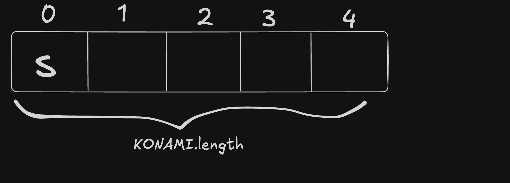
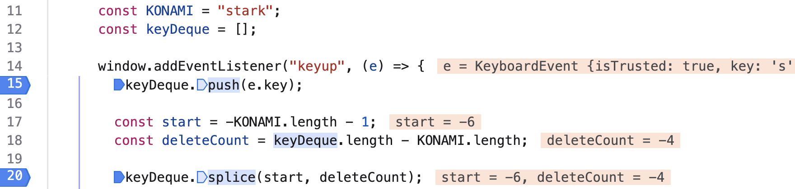
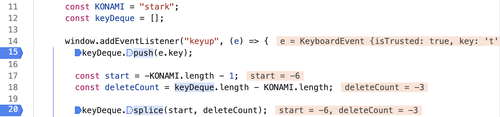
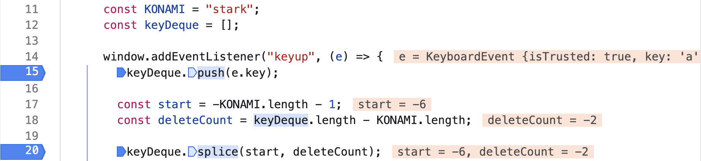
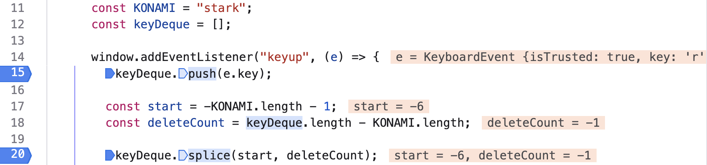
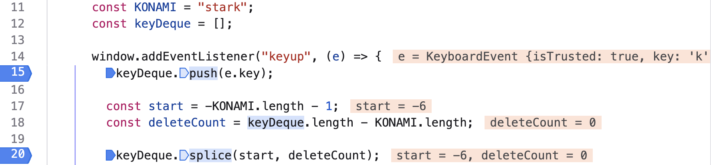
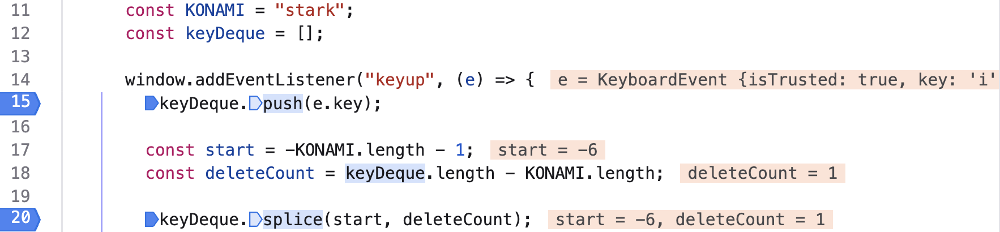

# Greetings

Welcome my dear reader to today's blog post.
I hope that you are having a good day, broading your knowledge base and hitting one target after the other.

# Overview

In today's blog post, we'll talk about how we can perform an action when the keybaord sequence is identified.

This blog was writter with the aim of showing and explaining how we can keep a fixed number of keys pressed by the user—we don't want to create a keylogger—and presenting some intricacies of the `Array.prototype.splice()` method.

# JavaScript Code
## The KONAMI Code and The Key Stack
First of all, let's assume that if the user types the `'s', 't', 'a', 'r', 'k'` key sequence the background will turn black.

Therefore:
```JavaScript
const KONAMI = "stark";
```

Furthermore, we need a data structure for keeping the characters (keys) that the user types. For this reason, an empty array, acting as deque, will be created:
```JavaScript
const keyDeque = [];
```

## Adding Event Listener
Having the target sequence and the key stack being defined, what remains is adding the event listener on `window`.

The event that the browser is listening to is `"keyup"`.
- For a key to be *up* it means that previously was *down*.
- Thus, when a key has been pressed, the browser is instructed to do something.

Finally, we want the `keyDeque` to hold as many characters as the `KONAMI.length`. Therefore, new characters will be added at the end of the `keyDeque` and the old ones will be discarded from the beginnng.

<details>
    <summary>Visualization of Deque</summary>
    <br/>
    
</details>
<br/>

```JavaScript
window.addEventListener("keyup", (e) => {
        keyDeque.push(e.key);

        const start = -KONAMI.length - 1;
        const deleteCount = keyDeque.length - KONAMI.length;

        keyDeque.splice(start, deleteCount);

        if (keyDeque.join('').includes(KONAMI)) {
          document.body.style.background = "black"
        } else {
          document.body.style.background = "white";
        }
      });
```

### Explaining The `Array.prototype.splice()` Method
You may be confused about the value of the `splice` arguments. It's alright, I was too!

Let's inspect the syntax of `splice`:
```text
splice(start);
splice(start, deleteCount);
splice(start, deleteCount, item1);
splice(start, deleteCount, item1, item2);
splice(start, deleteCount, item1, item2, /* …, */ itemN);
```

Regarding the `start` parameter:
- Negative index counts back from the end of the array.
  - If `-array.length <= start < 0`, `start + array.length` is used.
- If `start < -array.length`, `0` is used.
- If `start >= array.length`, **no element will be deleted**, but *the method will behave as an adding function*, adding as many elements as provided.
- If *start is omitted* (and `splice()` is called with no arguments), **nothing is deleted**.

Regarding the `deleteCount` parameter:
- *If deleteCount is omitted*, or if its value is greater than or equal to the number of elements after the position specified by start, **then all the elements from start to the end of the array will be deleted**.
- *If you wish to pass any itemN parameter*, **you should pass `Infinity` as `deleteCount` to delete all elements after start**
- If `deleteCount` is `0` or *negative*, **no elements are removed**.

> The above information can be found in [MDN Array.prototype.splice()](https://developer.mozilla.org/en-US/docs/Web/JavaScript/Reference/Global_Objects/Array/splice).

### Debugger Is A Friend of Ours
Let's add two breakpoint on our script to observe the scripts behaviour when the user types a character:
<details>
    <summary>User Presses <code>'s'</code></summary>
    <br/>
    When the user presses the <code>'s'</code> character:
    
    <ul>
        <li><code>-6 < -1 </code>, therefore <code>start = 0</code>.</li>
        <li><code>deleteCount</code> is a negative number, therefore no elements will be deleted.</li>
        <li>It's like calling <code>splice(0,-4)</code>.</li>
        <li>Thus, <code>keyDeque = ['s']</code>.</li>
    </ul>
</details>

<details>
    <summary>User Presses <code>'t'</code></summary>
    <br/>
    When the user presses the <code>'t'</code> character:
    
    <ul>
        <li><code>-6 < -2 </code>, therefore <code>start = 0</code>.</li>
        <li><code>deleteCount</code> is a negative number, therefore no elements will be deleted.</li>
        <li>It's like calling <code>splice(0,-3)</code>.</li>
        <li>Thus, <code>keyDeque = ['s', 't']</code>.</li>
    </ul>
</details>

<details>
    <summary>User Presses <code>'a'</code></summary>
    <br/>
    When the user presses the <code>'a'</code> character:
    
    <ul>
        <li><code>-6 < -3 </code>, therefore <code>start = 0</code>.</li>
        <li><code>deleteCount</code> is a negative number, therefore no elements will be deleted.</li>
        <li>It's like calling <code>splice(0,-2)</code>.</li>
        <li>Thus, <code>keyDeque = ['s', 't', 'a']</code>.</li>
    </ul>
</details>

<details>
    <summary>User Presses <code>'r'</code></summary>
    <br/>
    When the user presses the <code>'r'</code> character:
    
    <ul>
        <li><code>-6 < -4 </code>, therefore <code>start = 0</code>.</li>
        <li><code>deleteCount</code> is a negative number, therefore no elements will be deleted.</li>
        <li>It's like calling <code>splice(0,-1)</code>.</li>
        <li>Thus, <code>keyDeque = ['s', 't', 'a', 'r']</code>.</li>
    </ul>
</details>

<details>
    <summary>User Presses <code>'k'</code></summary>
    <br/>
    When the user presses the <code>'k'</code> character:
    
    <ul>
        <li><code>-6 < -5 </code>, therefore <code>start = 0</code>.</li>
        <li><code>deleteCount</code> is a negative number, therefore no elements will be deleted.</li>
        <li>It's like calling <code>splice(0, 0)</code>.</li>
        <li>Thus, <code>keyDeque = ['s', 't', 'a', 'r', 'k']</code>.</li>
    </ul>
</details>

<details>
    <summary>User Presses <code>'i'</code></summary>
    <br/>
    When the user presses the <code>'i'</code> character:
    
    <ul>
        <li><code>-6 <= -6 </code>, therefore <code>start = -6 + 6 = 0</code>.</li>
        <li><code>deleteCount = 1</code>, therefore an element will be deleted, the one at zero index.</li>
        <li>It's like calling <code>splice(0, 1)</code>.</li>
        <li>Thus, <code>keyDeque = ['t', 'a', 'r', 'k', 'i']</code>.</li>
    </ul>
</details>
<br/>

> In the above sections the `start` is determined by comparing `-KONAMI.length - 1` <= `keyDeque.length`.
>
> The value of `-KONAMI.length - 1` is always `-6`, what changes is the `keyDeque.length`.

## Full Code
```JavaScript
const KONAMI = "stark";
const keyDeque = [];

window.addEventListener("keyup", (e) => {
  keyDeque.push(e.key);

  const start = -KONAMI.length - 1;
  const deleteCount = keyDeque.length - KONAMI.length;

  keyDeque.splice(start, deleteCount);

  if (keyDeque.join("").includes(KONAMI)) {
    document.body.style.background = "black";
  } else {
    document.body.style.background = "white";
  }
});
```

# Conclusion
Thank you for staying up until the end of the post and I hope that you memorized the little intricacies of the `splice` method. That is, how the `start` parameter determines the call the `splice` method.</br>

One of the laws in my life is *my struggle, someone else's boost*. This is mainly the reason behind this posts. In this post, I was trying to understand the logic behind the `splice()` arguments and I considered that such a post would be helpful.

# Resources
- [JavaScript30](https://javascript30.com/)
- [Array.prototype.splice()](https://developer.mozilla.org/en-US/docs/Web/JavaScript/Reference/Global_Objects/Array/splice)