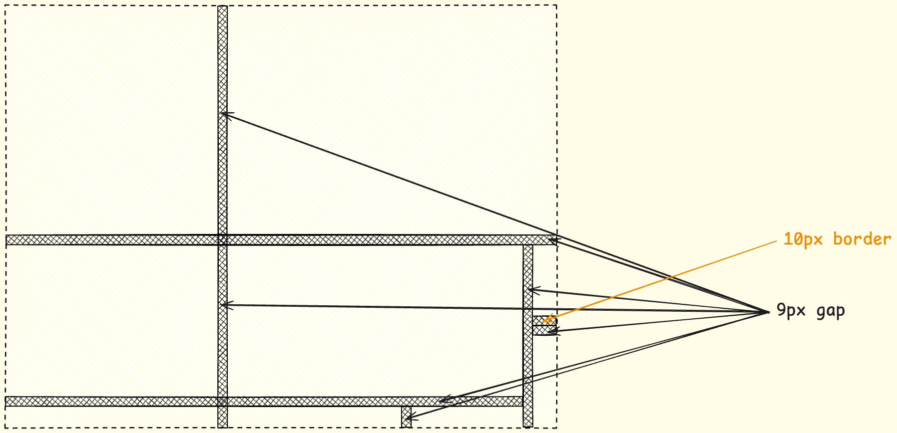
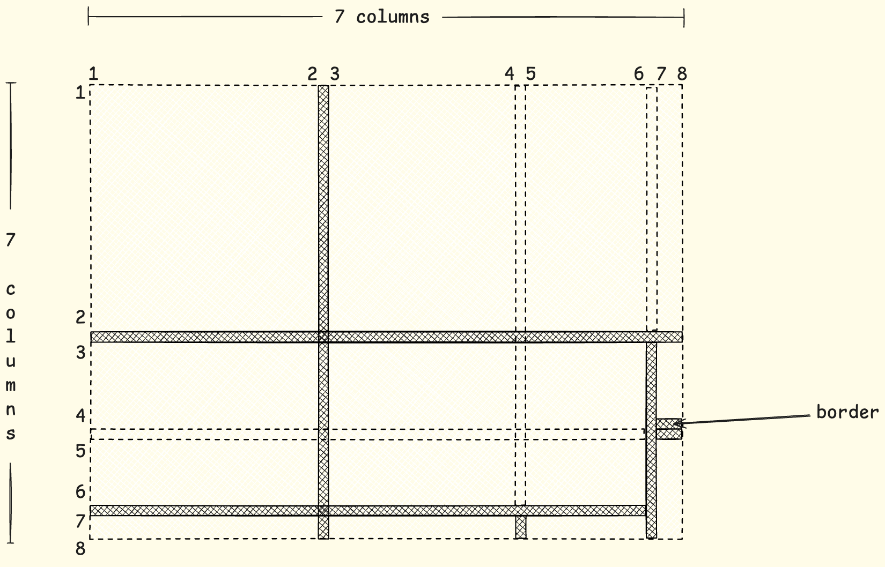
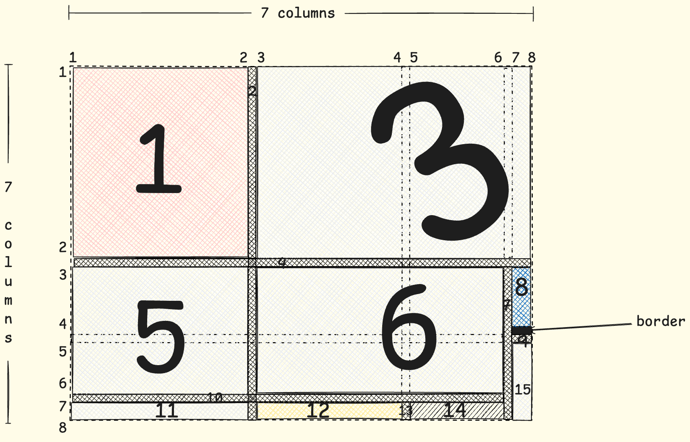
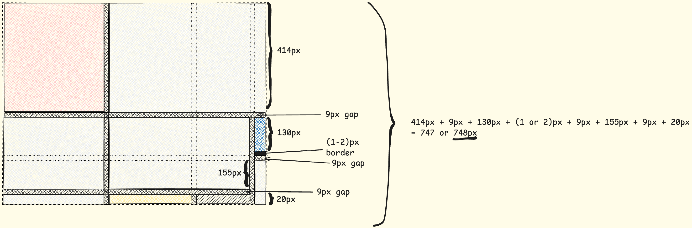
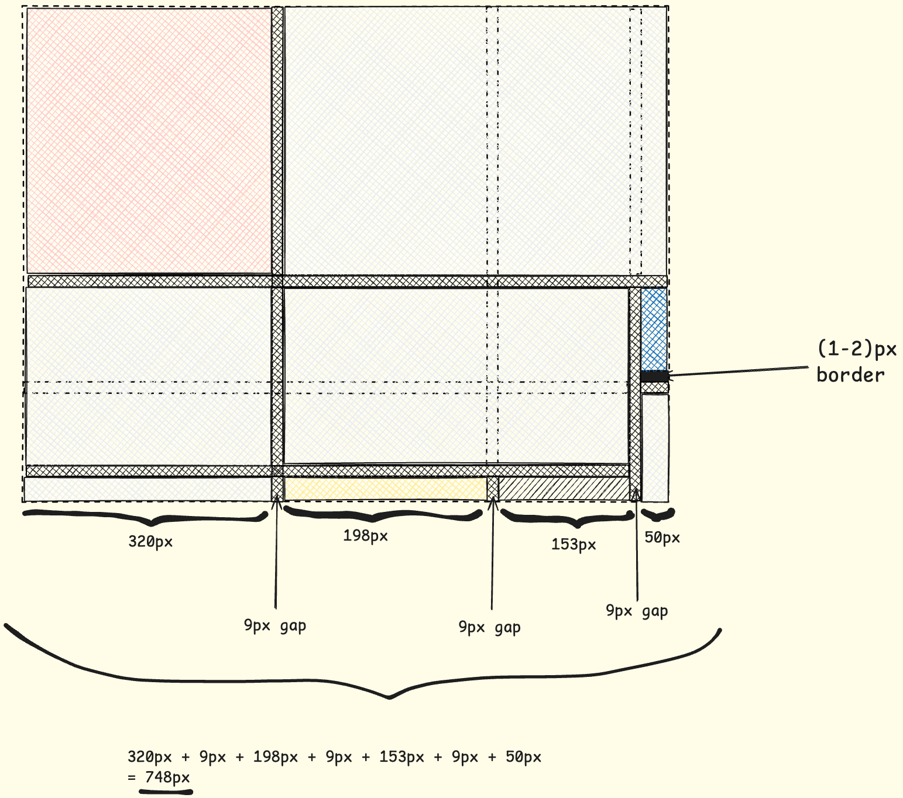
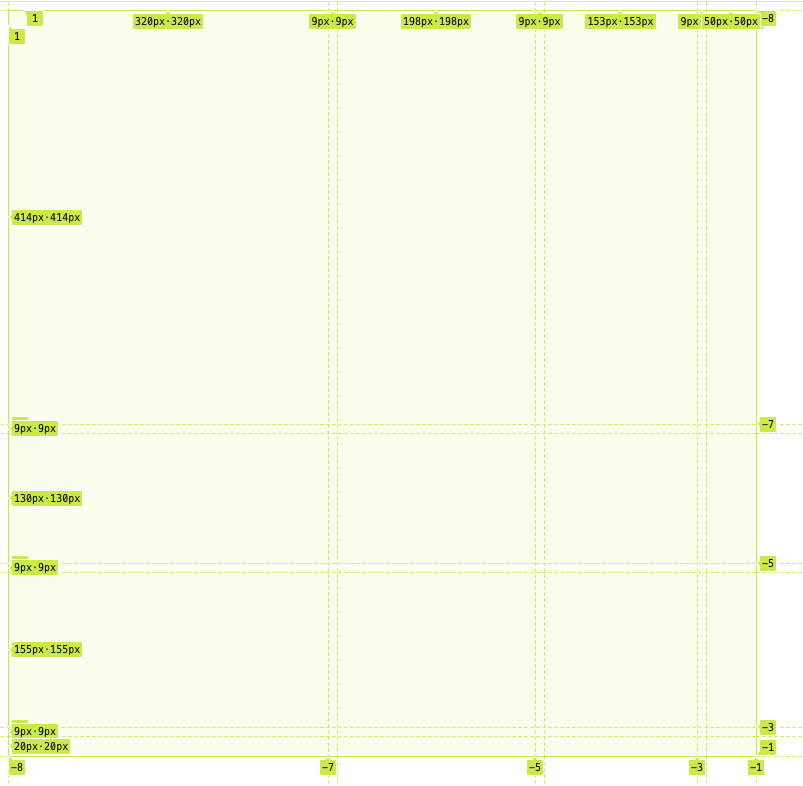
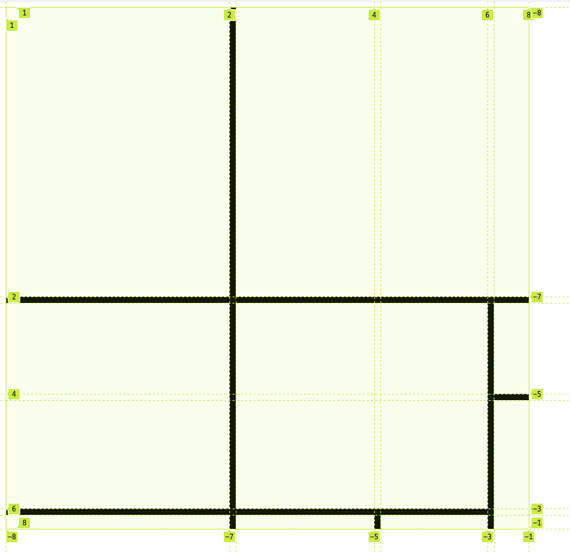
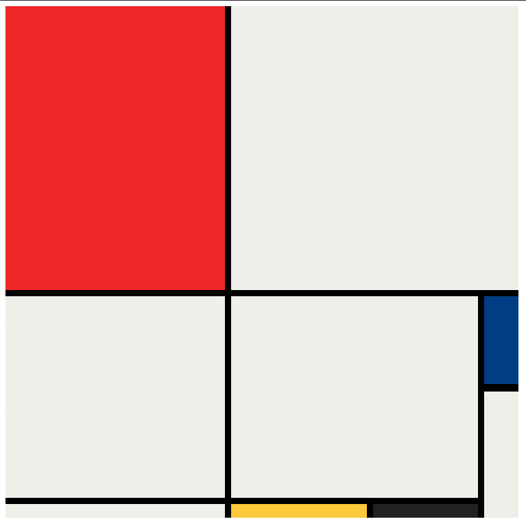

# Intro

Hello my dear reader, I hope that you are having a fantastic day.

In today's blog post, we are diving into the art by recreating a mondrian painting by utiling the *Grid Layout*. Therefore, without futher ado, let's start by analyzing the art, creating a custom design and then implementing.

# Requirement
The requirement for this project is to achieve the following end result:


# Design

Let's break the design into actionable steps.

## Gaps
Since the gaps have color and width and height, depending whether it is a horizontal or vertical gap, they should be **grid items**.


<br/><br/>

Now that gaps have been defined, it is time for contemplating on the rows and the columns of the grid layout:


> Taking into account the gaps, the layout will be a `7x7` grid.

> The last horizontal gap should have been mentally extended too, just like the other gap lines.

## Grid Items
Apart from the gaps, which are grid items too, let's define the rest grid items:


> **border** is not considered an element of the grid.


## Grid Dimensions
Having the grid and the grid items defined, including the gaps, let's put on the design the sizes of the rows and columns.

### Rows


> The requirements define that the height is `748px`.<br />
> If the border itself is `10px` that means in addition with the gap it would a `19px`, which would have exceed the requirements.<br />
> For this reason, in this project, the border of the blue grid item will be `2px`. <br />
> *This comment explains the parentheses in the sum of the heights.*

### Columns


# HTML Code
Perfect, having everything set and done, let's define our HTML code so that we can start using the grid layout:

```HTML
<body>
   <div class="grid-container">
    <div id="grid-item-1" class="red"></div>
    <div id="grid-item-2" class="gap"></div>
    <div id="grid-item-3" class="gray"></div>
    <div id="grid-item-4" class="gap"></div>
    <div id="grid-item-5" class="gray"></div>
    <div id="grid-item-6" class="gray"></div>
    <div id="grid-item-7" class="gap"></div>
    <div id="grid-item-8" class="blue"></div>
    <div id="grid-item-9" class="gap"></div>
    <div id="grid-item-10" class="gap"></div>
    <div id="grid-item-11" class="gray"></div>
    <div id="grid-item-12" class="yellow"></div>
    <div id="grid-item-13" class="gap"></div>
    <div id="grid-item-14" class="black"></div>
    <div id="grid-item-15" class="gray"></div>
   </div>
</body>
```

> The `id` attribute corresponds to the grid item as descriped in the custom design image.

# CSS Code
## Defining The Colors
```CSS
:root {
      --gap-color: #000;
      --white: #F0F1EC;
      --red: #E72F24;
      --black: #232629;
      --blue: #004592;
      --yellow: #F9D01E;
    }
```

## Defining The Grid Layout
```CSS
.grid-container {
      display: grid;
      grid-template: 414px 9px 130px 9px 155px 9px 20px / 320px 9px 198px 9px 153px 9px 50px;
    }
```



## Placing The Gap Grid Items
Let's start placing our gap grid items on the grid layout.

```CSS
.gap {
  background-color: var(--gap-color);
  }

#grid-item-2 {
  grid-column: 2 / 3 ;
  grid-row: 1 / -1;
}

#grid-item-13 {
  grid-column: 4 / 5;
  grid-row: -2 / -1;
}

#grid-item-7 {
  grid-column: 6 / 7;
  grid-row: -1 / 3;
}

#grid-item-4 {
  grid-row: 2 / 3;
  grid-column: 1 / -1;
}

#grid-item-9 {
  grid-row: 4 / 5;
  grid-column: -1 / 7;
}

#grid-item-10 {
  grid-row: -3 / -2;
  grid-column: 1 / -2;
}
```
> Following the column and row numbers from the design section, I believe the values for the `grid-row` and `grid-column` properties make sense.

<br />



## Placing The Rest Grid Items

```CSS
#grid-item-1 {
  grid-row: 1 / 2;
  grid-column: 1 / 2;
}

#grid-item-3 {
  grid-row: 1 / 2;
  grid-column: 3 / -1;
}

#grid-item-5 {
  grid-row: 3 / 6;
  grid-column: 1 / 2;
}

#grid-item-6 {
  grid-row: 3 / 6;
  grid-column: 3 / 6;
}

#grid-item-8 {
  grid-row: 3 / 4;
  grid-column: -2 / -1; /* or 7 / 8 */

  border-bottom-color: var(--gap-color);
  border-bottom-width: 2px;
  border-bottom-style: solid;
}

#grid-item-11 {
  grid-row: -2 / -1; /* or 7 / 8 */
  grid-column: 1 / 2;
}

#grid-item-12 {
  grid-row: -2 / -1; /* or 7 / 8 */
  grid-column: 3 / 4;
}

#grid-item-14 {
  grid-row: -2 / -1; /* or 7 / 8 */
  grid-column: 5 / 6;
}

#grid-item-15 {
  grid-row: 5 / -1;
  grid-column: -2 / -1; /* 7 / 8 */
}
```



# Conclusion

As you can see, the design phase took much longer the implementation one but this is usually what happens in the product lifecycle.

If you don't have an adequate design, then you are risking falling into the *looking into a blank screen* phase. Once everything has been laid out, it was easy instructing the grid items to occupy the correct grid cells.

# Greetings

As always, thank you for staying up to this point! I hope that through this challenge I transfered you the fact that *preparation* beats *fear*!

In any case, I am rooting for you to achieve your goals but above all stay healthy mentally and physically!

# Resources
- [Excalidraw](https://excalidraw.com/)
- [Full Code](https://codepen.io/w3b4rt/pen/MYWPQZp)