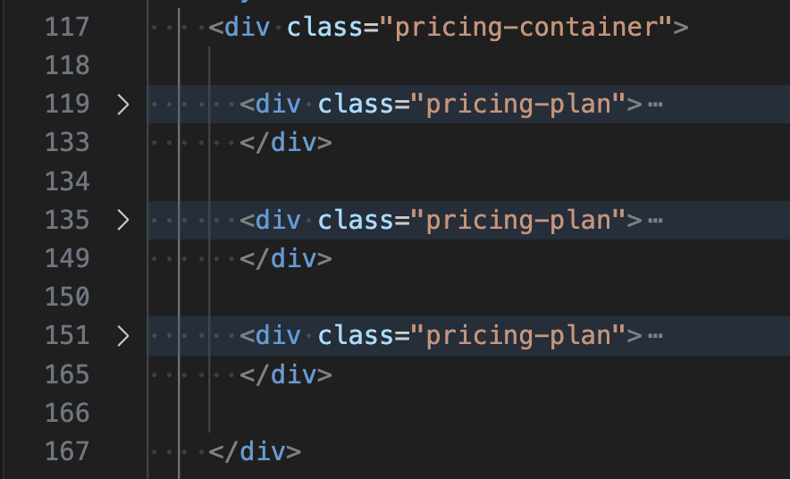

# Beginner - Pricing Table

Hello dear reader, thank you for your interest to my blog post. I hope you are having a wonderful day!

In case you are having a bad day, instead for letting the situation be on top of you, take a step back and ask yourself, *what is God trying to teach me?* Remember, *a smooth sea never made a skilled sailor*.

Putting my advise aside, I hope through this post you acquire some confidence in building a pricing table, which is common nowadays.

Without futher ado, let's tackle this challenge.

# HTML Code
This challenge is part of the *The Complete Full-Stack Web Development Bootcamp* offered on Udemy platform by *Dr. Angela Yu*.

I have modified the HTML a little bit, so it would be more HTML-semantically correct, since there were two `div`s for containing only:
1. The kind of the package (*Basic*, *Standard*, *Premium*) and
2. The price of the package (*$9.99*, *$19.99*, *$49.99*)

> The `div`s where substituted by `p` elements.

> Furthermore, a `details` element was added where I give attribution for the icons that I downloaded.

# CSS Code
The HTML code is pretty straightfoward.<br/>
We may need to explain some things in the CSS though.

## CSS Variables

First of all, some CSS variables were declared that contain the values of the colours taken from <a href="https://colorhunt.co/palette/f4f6fff3c623eb831710375c">Color Hunt</a>. These colours have been applied on the `.pricing-plan`, `.plan-header`, `.plan-button`.

```CSS
:root {
  --price-header: #EB8317;
  --pricing-plan-body: #10375C;
  --pricing-plan-text-color: #F4F6FF;
  --pricing-plan-button-color: #F3C623;
}
```
<br />

## Styling The `pricing-container` `div` Element

It is visible that the `div` element with the `pricing-container` class holds three `div` elements, the `pricing-plan`s.

<!--  -->

<br />
<br />

Since the desired layout in large viewports is the `pricing-plan` elements to be next to each other, the `pricing-container` `div` should be a flex container:

```CSS
.pricing-container {
  display: flex;
  gap: 1.3rem;
  justify-content: center;
  
  align-items: center;
  height: 100vh;
}
```
> The `height` property is necessary because initially the height of the `pricing-container` `div` is its content height. Therefore, since there is no enough height the `align-items` property will have no effect.

## Styling The `pricing-plan` `div` Elemenets
Styling the pricing plan cards is not such a mandane task, since if one is styled, the same CSS rules are applied to the other ones since they have the same class.

This `div` element contains:
```HTML
<div class="pricing-plan">
  
  <div class="plan-header">
    
    <p class="plan-title">Basic</p>
    <p class="plan-price">$9.99/month</p>
  </div>

  <ul class="plan-features">
    <li>✅ 10GB Storage</li>
    <li>✅ 1 User</li>
    <li>🚫 Support</li>
  </ul>

  <button class="plan-button">Sign Up</button>
</div>
```
- The `plan-header` contains an image and two `p` elements, which effectively constructs the header of the pricing plan card.
- The `ul` and `button` elements which are contained in the body of the pricing plan card.

<br />

First, a `height` property was defined to add a little height to the pricing plan cards. Then, the `div` was instructed to act a flex container and the vertical axis was defined as the direction of the flex container.

```CSS
.pricing-plan {
  /* Acting as Flex Item */
  border: 3px solid black;
  border-radius: 1rem;
  background-color: var(--pricing-plan-body);
  color: var(--pricing-plan-text-color);
  height: 30rem;


  /* Acting as Flex Container */
  display: flex;
  flex-direction: column;
  gap: 2rem;
  align-items: center;
  justify-content: space-between;
}
```
> The additional CSS rules are for visual appeal.

## Styling The `plan-header` `div` Element
This `div` contains the image and the two paragraph elements.

The one CSS rule that needs to be explained is the last one:
```CSS
.plan-header {
  border-top-left-radius: 1rem;
  border-top-right-radius: 1rem;
  border-bottom-right-radius: 0.5rem;
  border-bottom-left-radius: 0.5rem;

  background-color: var(--price-header);
  padding: 1rem;
  text-align: center;
  color: black;
  min-width: 20rem;
}
```
> Due the fact that the price of the basic pricing plan is `$9.99` as oppossed to `$19.99` and `$49.99`, the width of the `plan-header` of the first pricing plan card is slightly smalled than the others.<br /><br />
> The `min-width` property defines the size of the header, thus the header can't grow smaller than the defined value.<br /><br />
> This affects the size of the `pricing-plan` `div` too. Since the `div` should be large enough to fit the `plan-header` which can't grow smaller than the defined value.

## Responsive Design
The final requirement of the challenge was for the pricing plan card to be stacked on top of each other, in case there is no enough horizontal space. That is, when the user is visiting the page from a mobile device.

This can be done height easily by using a media query:
```CSS
@media (max-width: 1250px) {
  .pricing-container {
    flex-direction: column;
    height: 100%;
  }
}
```
> When there is not horizontal space, just change the direction of the flex container so that the pricing plan card are stacked on top of each other.

> The `height: 100%;` is neccessary in order to override the `height: 100vh;` CSS rule, so that there is enough space for the stacked `div`s to be displayed on a smaller screen. If the `height: 100vh;` is not overridden then the rule instructs the browser to display the pricing plan cards on a `100vh`, the full height of the viewport, which most likely will not have enough space, pushing the first `div` out of the viewport.


# Conclusion

Thank you for staying up until the end of the blog post. I appreciate you!

Good things take an effort to achieve them. The final state of this project was achieved on my 3rd try.<br /> Perserverance is a very important virtue in every human being.<br /> Deplete yourself from the ego that whispers that you are not good enough because you weren't able to achieve something on your first or even second try.

Remember:
> *For though the rightneous fall seven times, they rise again...*<br />
> \- Proverbs 24:16-18

Don't forget to pat yourself on the back!


# Resources
- [Udemy - The Complete Full-Stack Web Development Bootcamp](https://www.udemy.com/course/the-complete-web-development-bootcamp/)
- [Paper Bag Icon](https://www.flaticon.com/free-icon/paper-bag_8555084?term=paper+bag&page=1&position=48&origin=tag&related_id=8555084)
- [Gift Box Icon](https://www.flaticon.com/free-icon/giftbox_1140033)
- [Box Package Icon](https://www.flaticon.com/free-icon/package_595645)
- [Full Code](https://codepen.io/w3b4rt/pen/VYwxpoo)