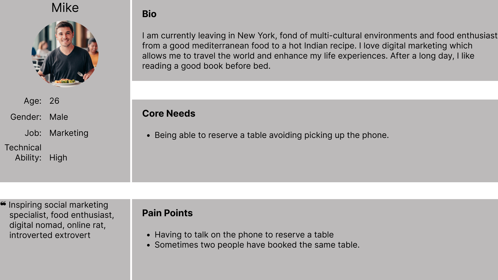
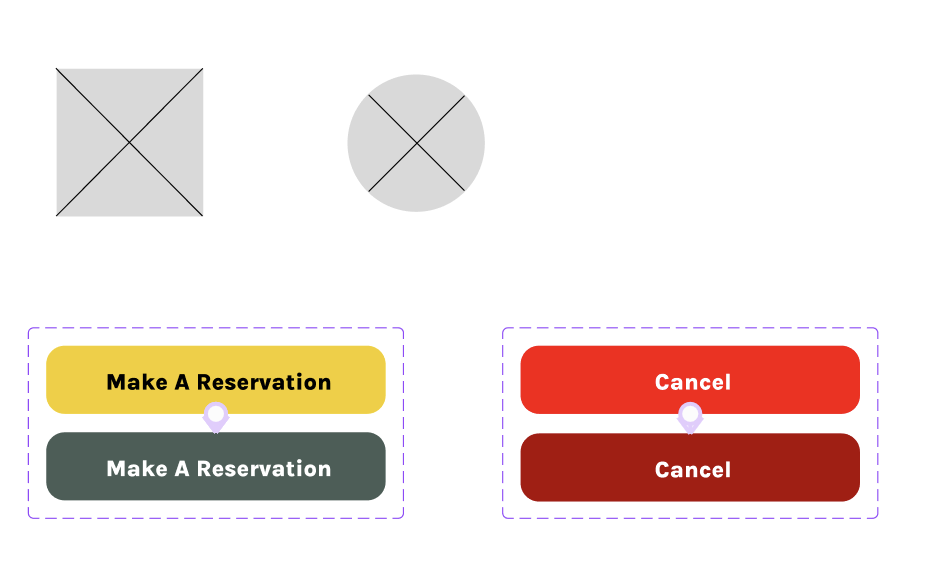
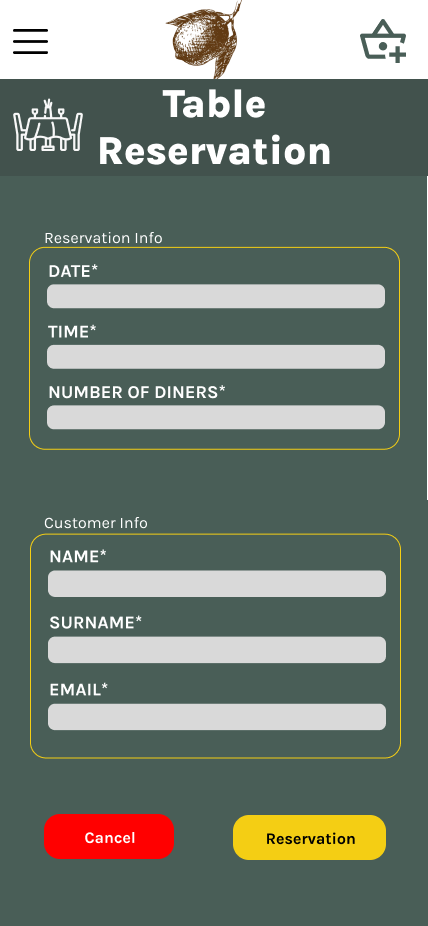
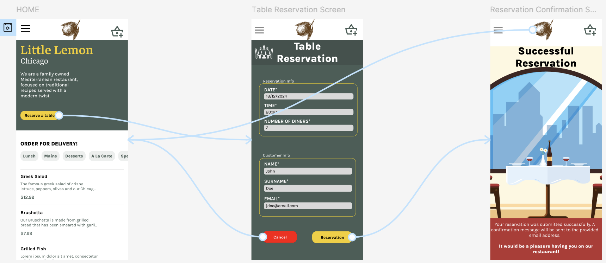

# Greetings

Greetings from a passionate beginner front-end engineer.
I hope that this post finds you healthy and well, and you are moving forward on achieving your goals.

# Overview
During my attendance of the *Principles of UX/UI Design* course, provided on Coursera by Meta and as part of my journey to acquire the Front-end Developer Professional Certificate, I had to design a reserve-a-table feature for a fictional restaurant.

The whole process involved using empathy tools such creating a persona and journey map. Having those artifacts produced, the wireframe of two screens were produced, the *table reservation screen* and the *reservation confirmation screen*. Finally, a high-fidelity prototype was created based on the wireframes.

# Persona Creation
In general, under the UX/UI Design context, artifacts are documents that the design team create to gather, organize and present information.
Persona is, except of one of the artifacts that is produced during the UX process, also a fictional character that portrays a possible user of our application. Though the persona is backed up with real data collected using various methods such as conducting customer interviews, using web analytics and making informed assumptions.

The user persona is a key tool in the *empathize* stage and its purpose is to aid the design team to focus on the WHOM they are designing for, the user's goals—WHY a user behaves in a certain way—and their frastructions.

Incorporating of the aforementioned information, the following persona was created for the needs of the assessment:

# Journey Map
Maps, which represent an area of land potentially including cities, roads, sightseeings, allow humans for centures to explain and navigate their way through the world. Customer journey maps are no different. They are graphical representation of how a customer interacts with our brand at various stages.

While common maps are spatial in nature, journey maps are based on a timeline of events which depict how the user behaves and what experiences—thoughts,feelings, verbal responses—at each stage. Finally, it includes opportunities of improvements and how those can be transform in actionable tasks.

Thus, putting all the pieces together the bigger picture looks like this:

Analyzing the map, a few common elements that are presents in most journey maps:
Actor | Expectations | Phases | Actions, Attitudes & Emotions | Opportunities
----- | ------------ | ------ | ----------------------------- | -------------
The user persona who goes through the phases (the journey). | The expactations, also known as scenario, align with the user persona's goals. | At a high-level the actions that the user persona is going to perform. It also acts as an organization unit of the actions, attitudes & emotions | As the name dictates, per phase, it includes the actions the user persona was performed, their thought, feelings and verbal responses while performing the action. | Opportunities are insights that are a result of the user persona's actions and lays the prospects of improving the user experience.

# Wireframing
We all have witnessed the *staring at a blank canvas* feeling or should I say *staring at a blank frame*?

Well, wireframing deals with that problem since, at the wireframe phase, a basic structure and design—without having to place colours, branding, and images—is considered. This allows for user experience to take all the spoting light.

A common practice while wireframing is to focus on the mobile version, leading to what is known as *mobile-first design*.

## Simple Component Creation
At first, some basic components were created such as:
- Square and circle placeholders, for image and icon placeholders.
- A *Make A Reservation* button component and
- A *Cancel* button component

## Reserve A Table Screen
The first screen that should be created with the *reserve a table* screen which contains a form allowing the user to add:
- The date and time of the reservation
- The number of diners
- The customer info

<figure>
    
    <figcaption><i>Picture 1: Table Reservation Wireframe</i></figcaption>
</figure>

## Reservation Confirmation Screen
Having a way for the user the reserve a table by providing the appropriate information, the confirmation screen should be designed as well.

<figure>
    
    <figcaption><i>Picture 2: Reservation Confirmation Wireframe</i></figcaption>
</figure>

# Prototyping
Can you imagine the frustration of investing time and effort in developing an application only to find out that it has bugs, functionality is missing and the user experience doesn't meet the expectated criteria? Well people before you and me had felt that frustration and introduced a process called prototyping.

Particularly in the UX/UI design, there is the term rapid prototyping. It is the process of mocking up an interface and validating it with the proper stakeholders—user or team member—iteratively.

Iteratively, under the context of UX/UI, means:
1. Create a screen (mock up) adhering to the specified requirements.
2. Test the mock up with the proper stakeholders.
3. Repeat!

## High-Fidelity Prototypes
High-fidelity prototypes closely resemble the finished product. While such prototypes are being designed, usually the focus is swifted on the visual design ensuring that the requirements are met.

### High-Fidelity Reserve A Table Prototype
<figure>
    
    <figcaption><i>Picture 3: Table Reservation Prototype</i></figcaption>
</figure>

### High-Fidelity Reservation Confirmation Prototype
<figure>
    
    <figcaption><i>Picture 4: Reservation Confirmation Prototype</i></figcaption>
</figure>

## Linking Screen Together
It is nice seeing the design coming to life but it is even better interacting with it. Therefore, using Figma's *Prototype* functionality, interactivity can be included to give a feeling of using the application.

<figure>
    
    <figcaption><i>Picture 5: Linking Screens Together</i></figcaption>
</figure>

## Interacting With The Screens
<figure>
    <video src="./media/ScreenInteractivity.mov" width="620" height="600" controls></video>
    <figcaption><i>Video 1: Screen Flow</i></figcaption>
</figure>

# Resources
- <a href="https://www.freepik.com/free-vector/hand-drawn-lemon-design_1079228.htm#fromView=search&page=1&position=9&uuid=6bd3d403-eada-4601-8075-e644c95f53cf&new_detail=true">Lemon Sketch Image by frimufilms on Freepik</a>
- <a href="https://www.freepik.com/icon/restaurant_13361535#fromView=search&page=1&position=51&uuid=c27c23a6-daef-446d-abdc-34bd43eea8d1">Restaurant Table Icon by mikan933 on Freepik</a>
- Culina Sydney, & Simmons, J. S. [J. Simmons]. (2020, February 13). Tips to Raise Customer Satisfaction at Restaurants. Culina Sydney. <a href="https://culinasydney.com.au/menu/">https://culinasydney.com.au/menu/</a>