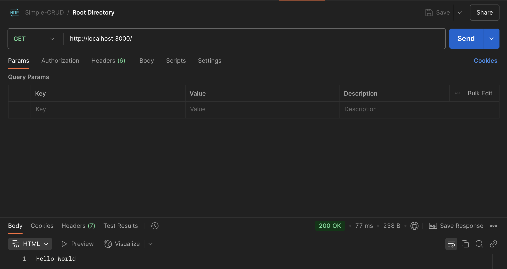
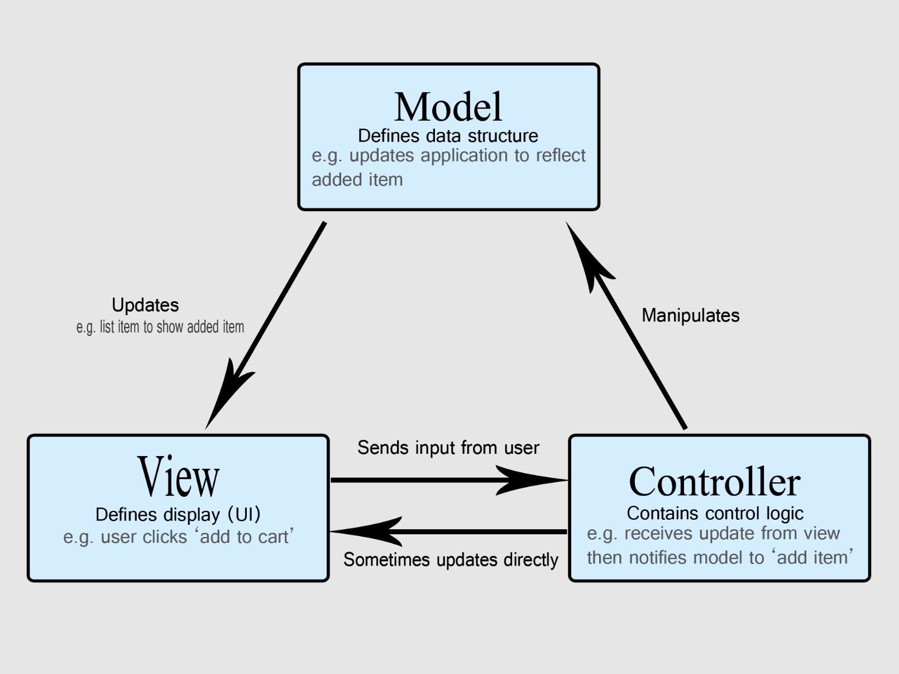
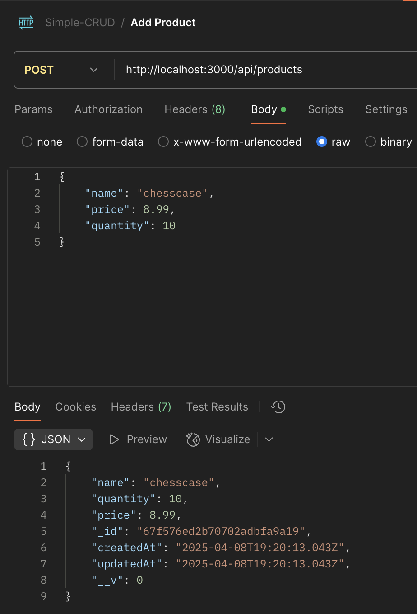
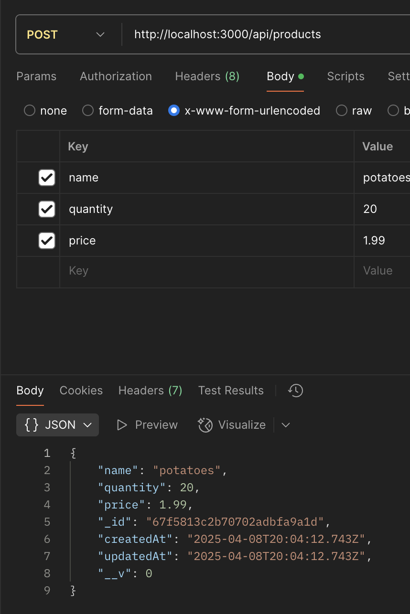
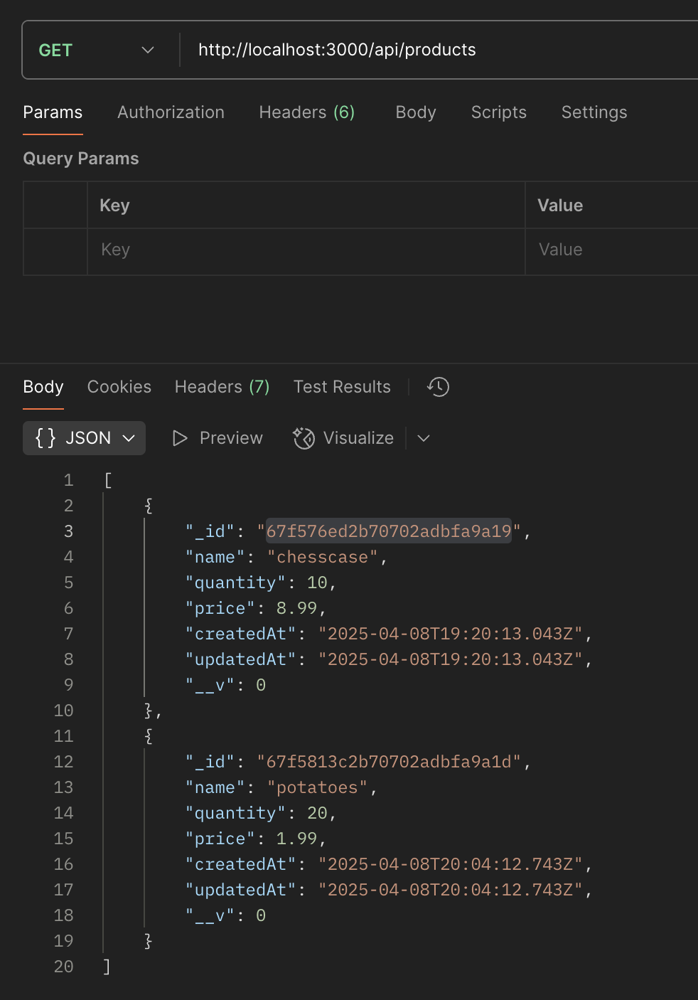
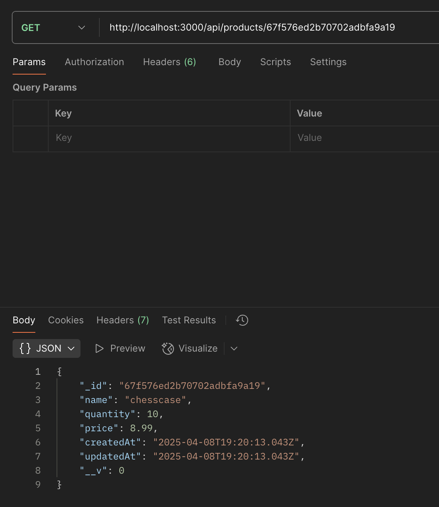
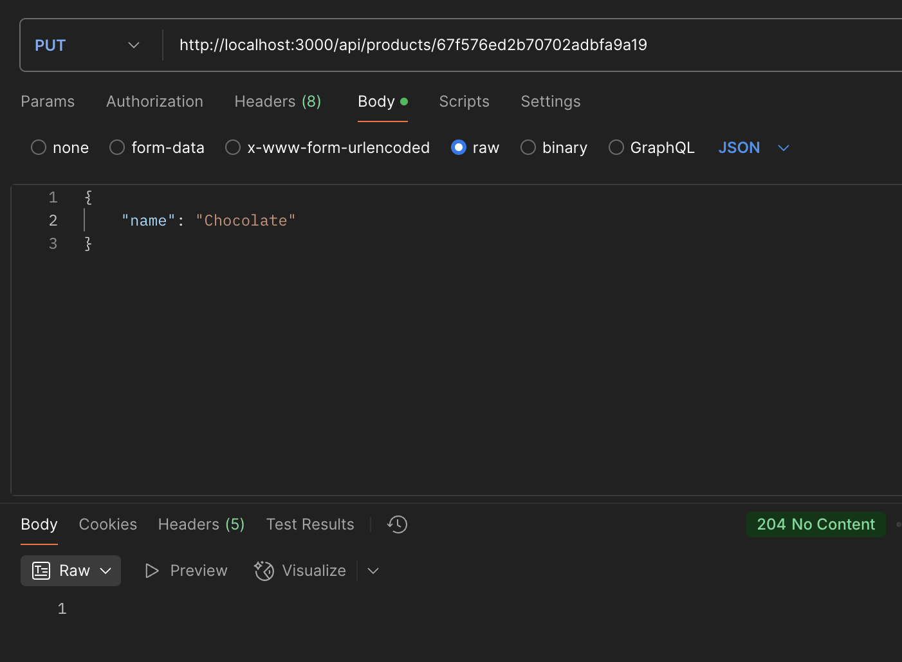
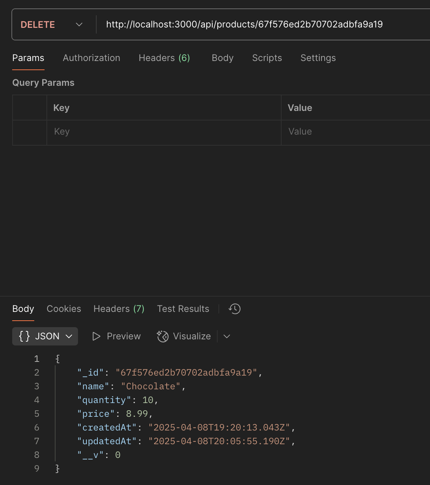

# Intro

Hello my dear reader, I hope you are having a fantastic day and you are here to learn something new or hopefully to applause my journey of enhancing my skillset. Ideally both!

In today's post, a simple CRUD API will be developed in NodeJS using a MongoDB as a database as instructed by *Coding Cleverly* on *freeCodeCamp.org*

# Initializing The Project
The very first thing that it should be done is to create a `package.json` file, which sets up a new `npm` package.

Thus, the contents of such a file should be similar to the one below:
```JSON
{
  "name": "crud-api",
  "version": "1.0.0",
  "main": "index.js",
  "scripts": {
    "test": "echo \"Error: no test specified\" && exit 1"
  },
  "keywords": [],
  "author": "",
  "license": "ISC",
  "type": "commonjs",
  "description": ""
}
```

> I am in a folder named `crud-api` thus the value of the key `"name"`.

> The value of the key `"main"` is `"index.js"`, which practically points to the file that starts everything in our project.

Therefore, in addition, let's create a `index.js` file as well:
```
\CRUD-API
  \package.json
  \index.js
```

# Running The Script
The script can be run using the following command:
```bash
node index.js
```

In order, though, to run the script via the package manager the following modification should be performed on the `package.json` file:
```JSON
{
  "name": "crud-api",
  "version": "1.0.0",
  "main": "index.js",
  "scripts": {
    "test": "echo \"Error: no test specified\" && exit 1",
    "serve": "node index.js"
  },
  "keywords": [],
  "author": "",
  "license": "ISC",
  "type": "commonjs",
  "description": ""
}
```

Having the `"serve"` key added in `package.json` file, we can run the `index.js` file by executing the following command:
```bash
node run serve
```

# Setting Up The Backend
To set up the backend, the Express.JS framework should be installed by executing:
```bash
npm i express
```

If the installation is successful, an entry in `package.json` should be added under the `"dependencies"` key:
```JSON
{
  "name": "crud-api",
  "version": "1.0.0",
  "main": "index.js",
  "scripts": {
    "test": "echo \"Error: no test specified\" && exit 1",
    "serve": "node index.js"
  },
  "keywords": [],
  "author": "",
  "license": "ISC",
  "type": "commonjs",
  "description": "",
  "dependencies": {
    "express": "^5.1.0"
  }
}
```

To make sure that our backend is working, we can use the Express.JS boilerplate:
```javascript
const express = require('express');
const app = express();

app.get('/', function (req, res) {
  res.send('Hello World');
});

app.listen(3000);
```

Using a client for requesting API endpoint, such as Postman, we can see that our backend is working:



## Installing `nodemon`
It is at our best interest, when there are changes, the serve to be re-run reflecting the changes, instead of having to manually stop and start the server.

For this reason, the `nodemon` package will be install as development dependency, since it is needed only during development. Thus, the following command should be executed:
``` bash
npm install nodemon --save-dev
```

After a successful installation, all it needs to be done is to modify the `package.json` file a little bit in order to use the `nodemon` package:
```JSON
{
  "name": "simple-crud",
  "version": "1.0.0",
  "main": "index.js",
  "scripts": {
    "test": "echo \"Error: no test specified\" && exit 1",
    "serve": "node index.js",
    "dev": "nodemon index.js"
  },
  "keywords": [],
  "author": "",
  "license": "ISC",
  "type": "commonjs",
  "description": "",
  "dependencies": {
    "express": "^4.21.2"
  },
  "devDependencies": {
    "nodemon": "^3.1.9"
  }
}
```

> Pay attention at the new entry in the `"scripts"` object.

# Setting Up The MongoDB Database

After a successful account creation and cluster set up, a connection string should available to you.


If you browse the collections of the cluster, you will find none. It will be created later when we define our *Model* component.
Though, let's add the name of our database on the connection string in advance:
```javascript
mongodb+srv://<db_user>:<db_password>@data-server.qgjeik7.mongodb.net/<Database-Name>?retryWrites=true&w=majority&appName=Data-Server
```

> Feel free to substitute the `<Database-Name>` with a name of your liking.

The next step is to install the needed dependencies in order to interact with the mongoDB and retrieve data:
- `mongodb` and
- `mongoose`

## Connecting To The MongoDB

Having the dependencies installed and the connection string at hand, it is desirable to connect first at the MongoDB instance and once a connection has been established to start the server:

```javascript
const uri = "mongodb+srv://<db_user>:<db_password>@data-server.qgjeik7.mongodb.net/ProductDB?retryWrites=true&w=majority&appName=Data-Server";

mongoose.connect(uri)
.then(() => {
    console.log("[+] Connection established to the MongoDB");
    app.listen(3000, () => console.log('[+] Server is running at port 3000'));
})
.catch(() => console.log('[X] Connection to the database failed'));
```

# MVC Architectural Pattern

The Model-View-Controller (MVC) architectural design pattern separates an application into three main groups of components:
- Model(s): Data
- View(s): What the user sees
- Controller(s): The middleman between Model and View.

This design pattern helps to achieve separation of concerns, which asserts that software should be separated based on the kinds of work it performs.



## Creating A Model Component
We need to define the data structure for our MongoDB collection:
```javascript
const mongoose = require('mongoose');

const ProductSchema = mongoose.Schema({
    name: {
        type: String,
        required: [true, "Please enter a product name"],
    },

    quantity: {
        type: Number,
        required: true,
        default: 0,
    },

    price: {
        type: Number,
        required: true,
        default: 0,
    },

    image: {
        type: String,
        required: false,
    },
}, {
    timestamps: true,
});


const Product = mongoose.model("Product", ProductSchema);

module.exports = Product;
```

> This file should added in /CRUD-API/models/product-model.js.

> The first argument of the `model()` method accepts the *singular* name of the collection.<br /><br/> Keep in mind that *mongoose* automatically looks for the **plural** version of your model name. Therefore, a collection name of *Product**s*** will be created.

## Creating A Controller Component
The controller component contains the proper user actions which manipulates the model component:

```javascript
const Product = require("../models/product-model.js");

const getProducts = async (req, res) => {
    try {
        const allProducts = await Product.find({});
        res.status(200).json(allProducts);
    } catch (error) {
        res.status(500).json({message: error.message});
    }
}

const getProductById = async (req, res) => {
    try {
        const { id } = req.params;
        const product = await Product.findById(id);
        res.status(200).json(product);
    } catch (error) {
        res.status(500).json({message: error.message});
    }
};

const createProduct = async (req, res) => {
    try {
        const product = await Product.create(req.body);
        res.status(200).json(product);
    } catch (error) {
        res.status(500).json({message: error.message});
    }
};

const updateProductById = async (req, res) => {
    try {
        const { id } = req.params;
        const product = await Product.findByIdAndUpdate(id, req.body);

        if(!product){
            return res.status(404).json({
                message: "Product not found"
            });
        }

        res.status(204).json(product);
    } catch (error) {
        res.status(500).json({
            message: error.message
        });
    }
};

const deleteProductById = async (req, res) => {
    try {
        const { id } = req.params;

        const deletedProduct = await Product.findByIdAndDelete(id);

        if(!deletedProduct){
            return res.status(404).json({
                message: "Product not found"
            });
        }

        res.status(200).json(deletedProduct);

    } catch (error) {
        res.status(500).json({
            message: error.message
        });
    }
};

module.exports = {
    getProducts,
    getProductById,
    createProduct,
    updateProductById,
    deleteProductById,
}
```

At the tutorial the tutor developed the `updateProductById` as such:
```javascript
const updateProductById = async (req, res) => {
    try {
        const { id } = req.params;
        const product = await Product.findByIdAndUpdate(id, req.body);

        if(!product){
            return res.status(404).json({
                message: "Product not found"
            });
        }

        // Get the updated product
        const updatedProduct = await Product.findById(id);
        res.status(200).json(updatedProduct);
    } catch (error) {
        res.status(500).json({
            message: error.message
        });
    }
};
```

From my perspective this violates the separation of concerns since the `updateProductById` both updates and retrieves the product. Therefore, my implementation is once the product is updated the server returns a `204 - No Content` status code.

## Creating Routes

Routes operate at the *Controller Layer* and map HTTP routes to functions that reside in the *product-controller.js* file. Usually the *Controller* is broken down to *Controllers* and *Routes* for a cleaner codebase, separation of concerns and reusability.

Therefore, the `CRUD-API/routes/product-route.js` file looks like:
```javascript
const express = require("express");
const { getProducts, getProductById, createProduct, updateProductById, deleteProductById } = require("../controllers/product-controller");
const router = express.Router();

router.get('/', getProducts);
router.get("/:id", getProductById);
router.post('/', createProduct);
router.put("/:id", updateProductById);
router.delete("/:id", deleteProductById);


module.exports = router;
```

## View Component

There is not a page where we display the data in some format, therefore there is no *View* Component.

# Setting Up The Middleware

Setting up the middleware can be done with a few JavaScript statements:
```javascript
const express = require('express');
const app = express()

app.use(express.json()); // Instructs the server to accept JSON payloads.

// Allows submitting information via a query string:
// https://example.com/?name=Chocolate&price=3.99&quantity=30"
app.use(express.urlencoded( { extended: false } ));
```

## Final `index.js` File

```javascript
const express = require('express');
const mongoose = require('mongoose');

const productRoute = require('./routes/product-route');
const app = express();

app.use(express.json());
app.use(express.urlencoded( { extended: false } ));

app.use("/api/products", productRoute);

app.get('/', function (req, res) {
  res.send('Hello World')
});

const uri = "mongodb+srv://<db-user>:<db-password>@data-server.lh3hoj8.mongodb.net/ProductDB?retryWrites=true&w=majority&appName=<Cluster-Name>";


mongoose.connect(uri)
.then( () => {
    console.log('[+] Connection Established to ProductDB');
    app.listen(3000, () => {
        console.log('[+] Server is running on port 3000');
    });
})
.catch( () => console.log('[X] Connection to the database failed'));
```

# Playing Around With Postman

Having everything said and done, let's inspect if our API works.

## Creating A Product

First, a product will be created using a JSON payload:

<br/>

Finally, another product will be created using a urlencoded payload:



## Retrieving Products

First, let's retrieve all the products:
<br/>

Finally, let's retrieve only the potatoes by using its id:
<br/>

## Updating A Product
Let's update the name of the `chesscase` to `chocolate`:


## Deleting A Product
Let's delete the `chocolate` product by using its id:


# Conclusion

Perfect everything works, our code is neat and clean and we just learnt how to create a simple API and setting up a backend environment.

I would like to thank for your staying up to this point and if you followed along give yourself a pat on the back, this was a milestone at your backend development journey ;).

Until my next blog post, I wish you nothing above else but health and I am rooting for you to achieve your goals and reach those milestone of yours.

Take care!

# Resources
- [CRUD API Tutorial](https://www.youtube.com/watch?v=_7UQPve99r4)
- [Overview of ASP.NET Core MVC](https://learn.microsoft.com/en-us/aspnet/core/mvc/overview?view=aspnetcore-9.0)
- [Common Design Principles](https://learn.microsoft.com/en-us/dotnet/architecture/modern-web-apps-azure/architectural-principles#separation-of-concerns)
- [MDN Web Docs - MVC](https://developer.mozilla.org/en-US/docs/Glossary/MVC)
- [Express.JS File Naming Conventions](https://www.restack.io/p/express-knowledge-file-naming-conventions)
- [Mongoose](https://www.npmjs.com/package/mongoose)
- [Query String](https://en.wikipedia.org/wiki/Query_string)
- [Final Code](https://github.com/lArch1t3ct/Simple-CRUD-API)